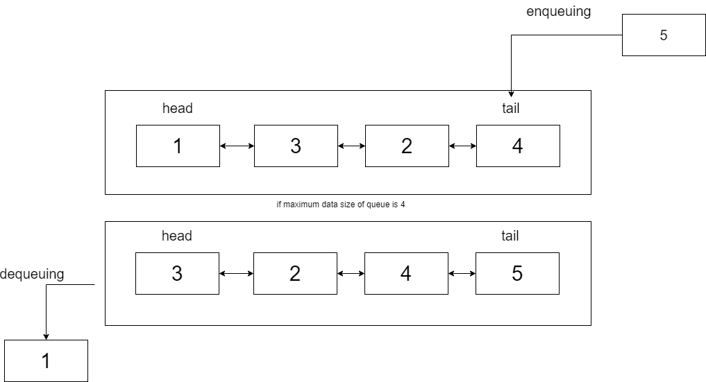

## <font color="DodgerBlue">Concept</font>
> **CircularQueue Buffer** is fixed size Queue which seems like FIFO queue. The difference between FIFO queue and CircularQueue Buffer is that unlike FIFO queue, CircularQueue Buffer shifts data when CircularQueue Buffer's size is maximum.
CircularQueue Buffer is developed by using this concept via circular queue concept.  
[Wiki : Circular Queue](https://en.wikipedia.org/wiki/Circular_buffer)




## <font color="DodgerBlue">Three types of CircularQueue Buffer</font>


### <font color="AquaBlue">1. QueueBufferArray</font>

+ Concept
> ```QueueBufferArray``` use array to implement CircularQueueBuffer. It is shifted when size is full.
+ Code
~~~ cpp
template <typename T, int bufferSize>
class QueueBufferArray
{
public:
	QueueBufferArray()
	{
		capacity_ = bufferSize;
		size_=head_ = tail_ = 0;
	}
	~QueueBufferArray() = default;
	QueueBufferArray(const T& data)
	{
		capacity_ = bufferSize;
		size_=head_ = tail_ = 0;

		for (int i = 0; i < bufferSize; i++)
		{
			enqueue(data);
		}
	}
	void enqueue(const T& data)
	{
        // if current size is maximum, shift all element and insert new elements
		if (size_ == capacity_) 
		{
			shiftBuffer();
			tail_--;
			buffer_[tail_++] = data;
			return;
		}

		buffer_[tail_++] = data;
		size_++;
	}
	T operator[](const int idx)const
	{
		return buffer_[idx];
	}
	void printAll()
	{
		for (int i = 0; i < tail_; i++)
		{
			cout << buffer_[i] << " ";
		}cout << endl;
	}
private:
	T buffer_[bufferSize + 1];

	int capacity_;
	int size_;
	int head_;
	int tail_;
	void shiftBuffer()
	{
		for (int i = 0; i < size_ - 1; i++)
		{
			buffer_[i] = buffer_[i + 1];
		}
	}
};
~~~

### <font color="AquaBlue">2. QueueBufferLinkedList</font>

+ Concept

> QueueBufferLinkedList use implements QueueBufferLinkedList by using linkedlist. 
Unlike other linkedlist, it use memory pool. (```Node```)

+ Code

~~~ cpp
#pragma once
#include <iostream>
using namespace std;
template <typename T>
struct Node
{

	Node* prev_;
	Node* next_;
	T data_;
	Node()
	{
		prev_ = nullptr;
		next_ = nullptr;
		data_={};
	}
	~Node() = default;
	void alloc(Node* prev, Node* next, const T&data)
	{
		data_ = data;
		prev_ = prev;
		next_ = next;
		if (prev_)prev_->next_ = this;
		if (next_)next_->prev_ = this;
		
		return;
	}
	void pop()
	{
		if (prev_)prev_->next_ = next_;

		if (next_)next_->prev_ = prev_;

		return;
	}

	
};

template <typename T, int N>
class  QueueBufferLinkedList
{

public:
	QueueBufferLinkedList()
	{
		capacity_ = N;
		bcnt_ = 0;
		size_ = 0;
		head_.next_ = &tail_;
		tail_.prev_ = &head_;
	
	}
	QueueBufferLinkedList(const T& initData)
	{
		capacity_ = N;
		bcnt_ = 0;
		size_ = 0;
		head_.next_ = &tail_;
		tail_.prev_ = &head_;
		
		for (int i = 0; i < N; i++)
		{
			enqueue(initData);
		}		
	}
	void enqueue(const T& data)
	{

		if (size_ == capacity_)
		{
			Node <T>* ptr = head_.next_;
			ptr->pop();
			ptr->alloc(tail_.prev_, &tail_, data);
			return;
		}
		else
		{
			buf_[bcnt_++].alloc(tail_.prev_, &tail_, data);
			size_++;
		}

		return;
	}
	T operator[](const int idx)const
	{
		if (idx >= 0)
		{
			Node<T>* ptr = head_.next_;
			for (int i = 0; i < idx; i++)
			{
				ptr = ptr->next_;
			}
			return ptr->data_;
		}
		else
		{
			Node<T>* ptr = tail_.prev_;
			for (int i = -1; i >idx; i--)
			{
				ptr = ptr->prev_;
			}
			return ptr->data_;
		}
	}
	void printAll()
	{
		Node<T>* ptr = (&head_)->next_;
		
		
		while (ptr != &tail_)
		{
			cout << ptr->data_ << " ";
			ptr = ptr->next_;
		}cout << endl;
	}
private:
	Node<T> buf_[N + 1];// Memory pool.
	int capacity_;
	int size_;
	int bcnt_;
	Node<T>head_;
	Node<T>tail_;
	bool IsEmpty() const
	{
		return head_.next_ == &tail_;
	}
};
~~~

+ Memory Pool
> [Wikipedia link](https://en.wikipedia.org/wiki/Memory_pool)

Since CircularQueueBuffer is fixed-size , we don't need memory allocation every time.
So use memory pool to achive memory optimization. ```Node``` is memory pool. 

```cpp
template <typename T> // by using template, Node can be used in all data types.
struct Node
{

	Node* prev_;
	Node* next_;
	T data_;
	Node()
	{
		prev_ = nullptr;
		next_ = nullptr;
		data_={};
	}
	~Node() = default;
	void alloc(Node* prev, Node* next, const T&data) // memory allocation
	{
		data_ = data;
		prev_ = prev;
		next_ = next;
		if (prev_)prev_->next_ = this;
		if (next_)next_->prev_ = this;
		
		return;
	}
	void pop() // delete memory (free memory)
	{
		if (prev_)prev_->next_ = next_;

		if (next_)next_->prev_ = prev_;

		return;
	}

	
};
```

### <font color="AquaBlue">SimpleBuffer</font>

+ Concept
> **SimpleBuffer** use array to implement [CirQualrQueueBuffer](./README.md). The difference between QueueBufferArray is that **SimpleBuffer** use modular operation. By using this, there is no shifting like QueueBufferArray

+ Code
  
~~~ cpp
#pragma once
#include <iostream>
using namespace std;

template<typename T, int bufferSize>
class SimpleBuffer
{
public:

	SimpleBuffer()
	{
		head_ = -1;
		tail_ = -1;
		size_ = 0;
		bufferSize_ = bufferSize;
	}
	~SimpleBuffer() = default;
	SimpleBuffer(const T& initdata)
	{
		head_ = -1;
		tail_ = -1;
		size_ = 0;
		bufferSize_ = bufferSize;
		for (int i = 0; i < bufferSize_; i++)
		{
			enqueue(initdata);
		}
	}
	T front() const
	{
		if (isEmpty()) { return T(); }

		return buffer[head_];
	}
	T tail() const
	{
		if (isEmpty()) { return T(); }


		return buffer[tail_];
	}
	void enqueue(const T& data)
	{
		if (IsFull())
		{
			dequeue();
			enqueue(data);
			return;
		}
		else
		{
			if (head_ == -1) { head_ = 0; }

			tail_ = (tail_ + 1) % (bufferSize_);
			buffer[tail_] = data;
			size_++;
		}
	}
	T operator[](const int idx) const // don't want to return l-value. Queue's data only changed by enqueue and dequeue
	{

		if (idx >= 0)
		{
			return buffer[(head_ + idx) % bufferSize_];
		}
		else
		{
			return buffer[(head_ + size_ + idx) % bufferSize_];
		}
	}

	void dequeue()
	{
		if (isEmpty())
		{
			return;
		}
		else
		{
			if (head_ == tail_)
			{
				head_ = -1, tail_ = -1;
			}
			else
			{
				head_ = (head_ + 1) % bufferSize_;
			}
		}

		size_--;

	}
	void printAll()
	{
		int i = head_;
		if (isEmpty())
		{
		
			return;
		}


		int idx = head_;

		for (idx = head_; idx != tail_; idx = (idx + 1) % bufferSize_)
		{
			cout << buffer[idx] << " ";
		} cout << buffer[idx] << endl;


		return;
	}
private:

	int head_;
	int tail_;
	int size_;
	int bufferSize_;
	T buffer[bufferSize] = {};
	bool IsFull() const
	{

		if (head_ == 0 && tail_ == (bufferSize_ - 1))
		{
			return true;
		}
		if (head_ == tail_ + 1)
		{
			return true;
		}
		return false;

	}
	bool isEmpty() const
	{
		if (head_ == -1) { return true; }

		else { return false; }
	}

};
~~~

## <font color="DodgerBlue"> Reference</font>

1. [Reference Github](https://github.com/fredhur/CircularQueueBuffer)
2. [Reference Site](https://www.programiz.com/dsa/circular-queue)


