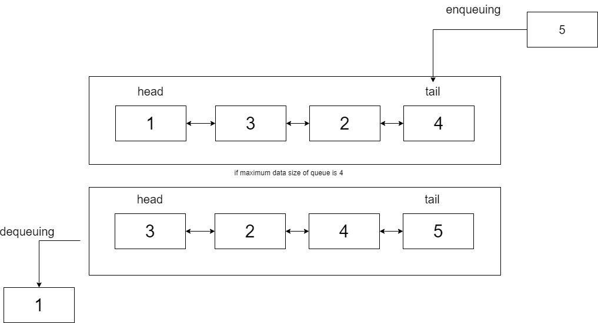

## 1. Concept
> **CircularQueue Buffer** is fixed size Queue which seems like FIFO queue. The difference between FIFO queue and CircularQueue Buffer is that unlike FIFO queue, CircularQueue Buffer shifts data when CircularQueue Buffer's size is maximum.
CircularQueue Buffer is developed by using this concept via circular queue concept.  
[Wiki : Circular Queue](https://en.wikipedia.org/wiki/Circular_buffer)

## Three types of CircularQueue Buffer

### QueueBufferArray

### QueueBufferLinkedList

### SimpleBuffer

